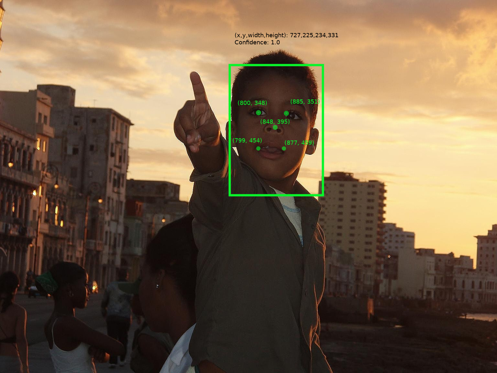

# Facial Landmark Detection Model

This model provides 5-points facial landmark detection. This model provides only landmark position while assuming that a given image is a fully fitted to a face.

## Model Description

Model is based on [Tweaked-CNN](https://talhassner.github.io/home/publication/2017_TPAMI_2) as a backbone architecture. This model is trained with Keras(2.2.4) and then converted to Tensorflow(1.13) model. Then, finally, it is converted to tensorflow-lite.
This model is tested with Tensorflow Lite version 1.13.

### Models

#### Input Layers

- Name: `INPUT_TENSOR_NAME`
- Shape: [1x128x128x3]
- Format: [NxCxHxW] where a
  - N: batch size
  - H: height of image(tensor)
  - W: width of image(tensor)
  - C: number of channels
- Order of channels: R-G-B

#### Output Layers

- Name: `OUTPUT_TENSOR_NAME`
- Shape: [1x10]
  - Denote 5 landmarks' locations with (*x*, *y*) coordinate: `left eye`, `right eye`, `a tip of nose`, `both ends of lip`.

| Model | Tweaked-CNN |
| --- | --- |
| input tensor size | 128 x 128 |
| mean | 0.0 |
| std  | 1.0 |
| order | NCHW |
| input layer | INPUT_TENSOR_NAME |
| output layer | OUTPUT_TENSOR_NAME |

### Image

Input image can be downloaed from [LINK](https://storage.googleapis.com/openimages/web/visualizer/index.html?set=train&type=detection&c=%2Fm%2F0dzct&id=685b11ed520f563b), which is originally from [Boy on the Malecon by Barbara Walsh](https://c4.staticflickr.com/6/5017/5518891311_a82dfa594f_o.jpg) with CC-BY-2.0.

