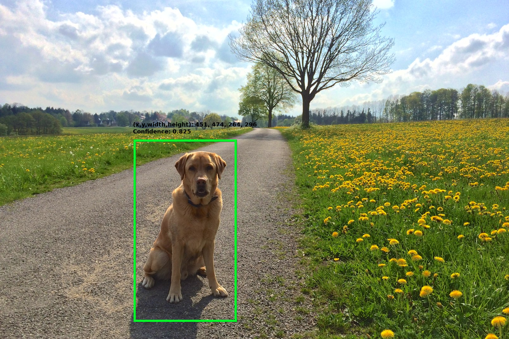

# Object Detection Model

This model provides object detection. The objects which can be detected with this model is listed in [a label file](object-detection-label.txt)

## Model Description

Model is based on MobileNet-V2 as a backbone architecture with a Single Shot Detector(SSD). This model is trained with Keras(2.2.4) and then converted to Tensorflow(1.13) model. Then, finally, it is converted to tensorflow-lite.
This model is tested with Tensorflow Lite version 1.13.

### Models

#### Input Layers

- Name: `normalized_input_image_tensor`
- Shape: [1x300x300x3]
- Format: [NxCxHxW] where a
  - N: batch size
  - H: height of image(tensor)
  - W: width of image(tensor)
  - C: number of channels
- Order of channels: R-G-B
- Input image(tensor) should be normailized to -1.0 ~ 1.0

#### Output Layers

- There are four tensors, named of:
  - `TFLite_Detection_PostProcess`
    - Denote locations. Shape is [1xNx4] where N is the number of objects and the format is [`y_min`, `x_min`, `y_max`, `x_max`].
  - `TFLite_Detection_PostProcess:1`
    - Denote label. Shape is [1xN] where N is the number of object.
  - `TFLite_Detection_PostProcess:2`
    - Denote confidence. Shape is [1xN] where N is the number of objects.
  - `TFLite_Detection_PostProcess:3`
    - Denote number of objects.

| Model | MobileNet-V2 + SSD |
| --- | --- |
| input tensor size | 300 x 300 |
| mean | 127.5 |
| std  | 127.5 |
| order | NCHW |
| input layer | normalized_input_image_tensor |
| output layer | TFLite_Detection_PostProcess, TFLite_Detection_PostProcess:1, TFLite_Detection_PostProcess:2, TFLite_Detection_PostProcess:3 |

### Image

Input image can be downloaed from [LINK](https://storage.googleapis.com/openimages/web/visualizer/index.html?set=train&type=detection&c=%2Fm%2F0bt9lr&id=a0e4634bd49881ba), which is originally from [ IMG_2010 by Michael Mienert](https://c3.staticflickr.com/3/2933/14304856435_4ba52cebe6_o.jpg) with CC-BY-2.0.

